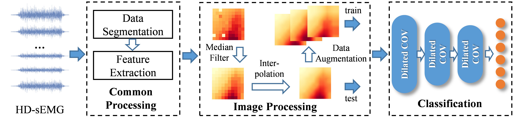
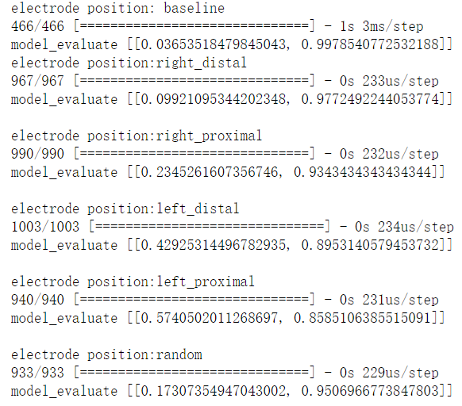

# Improved High-density Myoelectric Pattern Recognition Control Against Electrode Shift Using Data Augmentation and Dilated Convolutional Neural Network
By [Le Wu](https://github.com/wule1994), Xu Zhang, [Kun Wang](https://scholar.google.com/citations?hl=zh-CN&user=q5g9Y5sAAAAJ), [Xiang Chen](https://scholar.google.com/citations?hl=en&user=JURnq4QAAAAJ), [Xun Chen](http://staff.ustc.edu.cn/~xunchen/index.htm)

This document contains tutorial for running the codes associated with the method reported in the paper entitled "Improved High-density Myoelectric Pattern Recognition Control Against Electrode Shift Using Data Augmentation and Dilated Convolutional Neural Network", whcih has been accepted by IEEE Transactions on Neural Systems and Rehabilitation Engineering. You can refer to "https://ieeexplore.ieee.org/document/9223702" for the published paper, and if you build upon our work, please cite our work with:  
L. Wu, X. Zhang, K. Wang, X. Chen and X. Chen, "Improved High-density Myoelectric Pattern Recognition Control Against Electrode Shift Using Data Augmentation and Dilated Convolutional Neural Network," in IEEE Transactions on Neural Systems and Rehabilitation Engineering, doi: 10.1109/TNSRE.2020.3030931.

## Principle
  
***Objective***: the objective of this work is to develop a robust myoelectric control scheme towards alleviating the interference of electrode shift.  
***Methods***: a novel preprocessing framework was first presented to convert high-density surface electromyogram (HD-sEMG) signals into a series of images, and the electrode shift was appeared as pixel shift in images. Next, a data augmentation method was applied to the training data, so as to simulate HD-sEMG images from shift positions. Given the augmented training dataset, the dilated convolutional neural networks (DCNN) were subsequently applied for classification. Compared to normal convolutional neural networks (CNN), DCNN always contained a larger receptive field that was supposed to be adept in mining wider contextual information in images. Further, this property was confirmed to be fit with the gesture classification using HD-sEMG. The performance of the proposed method was evaluated with HD-sEMG data recorded by one 10×10 electrode array. The array was placed on the surface of extensors in forearm. Additionally, ten recruited subjects were asked to perform six wrist and finger extension tasks.  
***Results***: Under variety electrode shift conditions, high classification accuracy of 95.34% was achieved with the proposed architecture, which was superior to 78.46% obtained by the commonly used LDA method. Conclusion: The proposed method is demonstrated to be a promising solution towards alleviating interference imposed by electrode shift.  
***Significance***: This work will reduce the burden on the users who operate myoelectric pattern recognition systems.

## License

The repository is released under the MIT License.

## Installing dependencies
The code is developed based on the Keras framwork.  
**Keras (version: 2.2.4)**: we use tensorflow backend. The Keras installation and introduction are available at [`https://keras.io/`](https://keras.io/).  
**tensorflow (version: 1.13.1)**: tensorflow installation instructions are available at [`https://www.tensorflow.org/`](https://www.tensorflow.org/).

## Demonstration with an exemplary dataset
This is a demo when running our codes on an exemplary dataset, which can also be publicly downloaded via the same link as the source codes. Here are step-by-step instructions from downloading both the source codes and the data to result display: 

### preparation
* Download the data folder [[link](https://bit.ly/2VuALIW)] , this folder contains HD-sEMG data collected from baseline and shift positions.  
* Download the model folder [[link](https://bit.ly/2Vc99cH)], this folder includes one pretrained model. 
For more details, you can refer to the source code or leave a message in the issue.

For more details, you can referring to the correspond code files or leave a message in the issue.

### Result display 
To obtain the results, you need to run the `shiftRobustMPR.ipynb` file, which contains all codes and descriptions. The code will print the classification accuracy under different shift condition in such way:
 
